<h2>Tensorflow-Image-Segmentation-Pre-Augmented-Lizard-Consep (2024/12/03)</h2>

This is the first experiment of Image Segmentation for Lizard-Consep 
 based on 
the latest <a href="https://github.com/sarah-antillia/Tensorflow-Image-Segmentation-API">Tensorflow-Image-Segmentation-API</a>, and
 a pre-augmented <a href="https://drive.google.com/file/d/16zPgXvxgIf2d80wYqS9uBzsKiz2zXhSI/view?usp=sharing">
Lizard-Consep-ImageMask-Dataset.zip</a>, which was derived by us from Consep category of 
<a href="https://www.kaggle.com/datasets/aadimator/lizard-dataset"><b>Lizard dataset</b></a>
 
 
<b>Data Augmentation Strategy:</b> 
 To address the limited size of Lizard-Consep, 
 we employed <a href="./generator/ImageMaskDatasetGenerator.py">an offline augmentation tool</a> to generate a pre-augmented dataset, which supports the following augmentation methods.
<li>Vertical flip</li>
<li>Horizontal flip</li>
<li>Rotation</li>
<li>Shrinks</li>
<li>Shears</li> 
<li>Deformation</li>
<li>Distortion</li>
<li>Barrel distortion</li>
<li>Pincushion distortion</li>
 
Please see also the following tools  
<li><a href="https://github.com/sarah-antillia/Image-Deformation-Tool">Image-Deformation-Tool</a></li>
<li><a href="https://github.com/sarah-antillia/Image-Distortion-Tool">Image-Distortion-Tool</a></li>
<li><a href="https://github.com/sarah-antillia/Barrel-Image-Distortion-Tool">Barrel-Image-Distortion-Tool</a></li>

 

 

<b>Actual Image Segmentation for Images of 512x512 pixels</b> 
As shown below, the inferred masks look similar to the ground truth masks.  

<table>
<tr>
<th>Input: image</th>
<th>Mask (ground_truth)</th>
<th>Prediction: inferred_mask</th>
</tr>
<tr>
<td>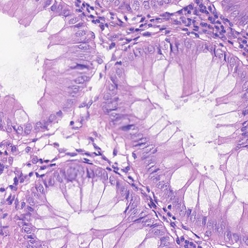</td>
<td>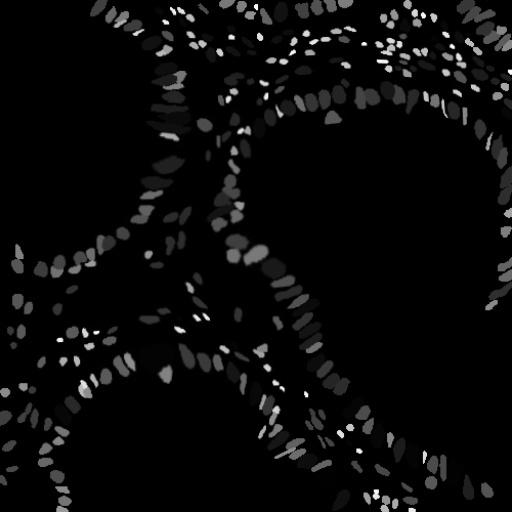</td>
<td>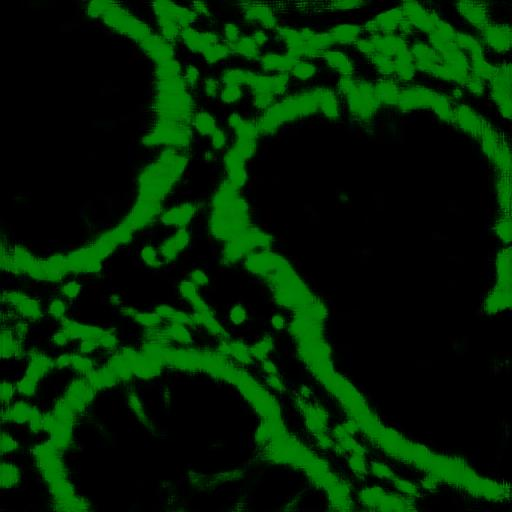</td>
</tr>

<tr>
<td>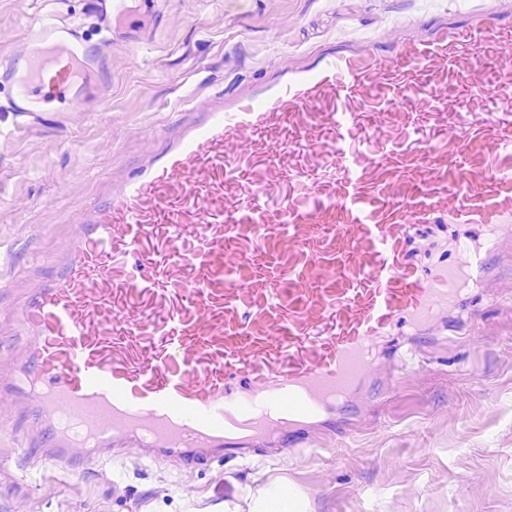</td>
<td>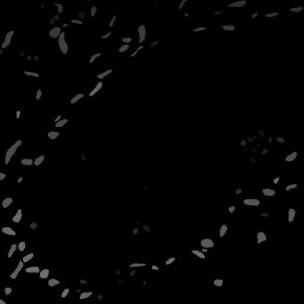</td>
<td>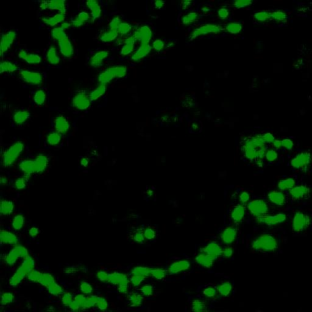</td>
</tr>

<tr>
<td>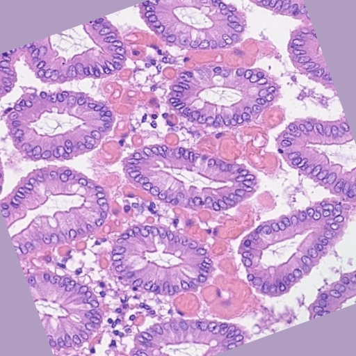</td>
<td>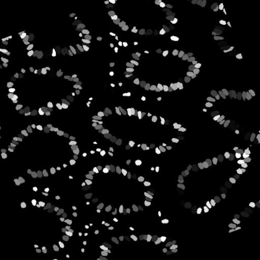</td>
<td>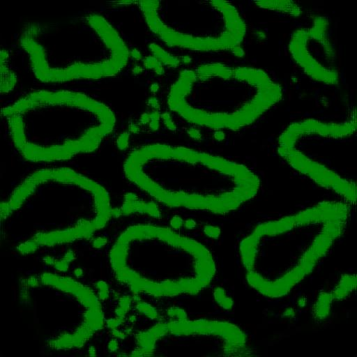</td>
</tr>
</table>

 
In this experiment, we used the simple UNet Model 
<a href="./src/TensorflowUNet.py">TensorflowSlightlyFlexibleUNet</a> for this Lizard-ConsepSegmentation Model. 
As shown in <a href="https://github.com/sarah-antillia/Tensorflow-Image-Segmentation-API">Tensorflow-Image-Segmentation-API</a>.
you may try other Tensorflow UNet Models: 

<li><a href="./src/TensorflowSwinUNet.py">TensorflowSwinUNet.py</a></li>
<li><a href="./src/TensorflowMultiResUNet.py">TensorflowMultiResUNet.py</a></li>
<li><a href="./src/TensorflowAttentionUNet.py">TensorflowAttentionUNet.py</a></li>
<li><a href="./src/TensorflowEfficientUNet.py">TensorflowEfficientUNet.py</a></li>
<li><a href="./src/TensorflowUNet3Plus.py">TensorflowUNet3Plus.py</a></li>
<li><a href="./src/TensorflowDeepLabV3Plus.py">TensorflowDeepLabV3Plus.py</a></li>

 

<h3>1. Dataset Citation</h3>
The dataset used here has been taken from the following kaggle web-site: 
<a href="https://www.kaggle.com/datasets/aadimator/lizard-dataset"><b>Lizard dataset</b></a>
 
The largest known nuclear instance segmentation and classification dataset
  
<b>About Dataset</b> 
The development of deep segmentation models for computational pathology (CPath) can help foster the investigation of 
interpretable morphological biomarkers. Yet, there is a major bottleneck in the success of such approaches 
because supervised deep learning models require an abundance of accurately labelled data. 
This issue is exacerbated in the field of CPath because the generation of detailed annotations usually demands 
the input of a pathologist to be able to distinguish between different tissue constructs and nuclei. 
Manually labelling nuclei may not be a feasible approach for collecting large-scale annotated datasets, 
especially when a single image region can contain thousands of different cells. 
Yet, solely relying on automatic generation of annotations will limit the accuracy and reliability of ground truth. 
Therefore, to help overcome the above challenges, we propose a multi-stage annotation pipeline to enable the 
collection of large-scale datasets for histology image analysis, with pathologist-in-the-loop refinement steps. 
Using this pipeline, we generate the largest known nuclear instance segmentation and classification dataset, 
containing nearly half a million labelled nuclei in H&E stained colon tissue. We will publish the dataset and 
encourage the research community to utilise it to drive forward the development of downstream cell-based models in CPath.
 
 
<b>Link to the dataset paper.</b> 
<b>Citation</b> 
@inproceedings{graham2021lizard, 
  title={Lizard: A Large-Scale Dataset for Colonic Nuclear Instance Segmentation and Classification}, 
  author={Graham, Simon and Jahanifar, Mostafa and Azam, Ayesha and Nimir, Mohammed and Tsang,  
  Yee-Wah and Dodd, Katherine and Hero, Emily and Sahota, Harvir and Tank, Atisha and Benes, Ksenija and others}, 
  booktitle={Proceedings of the IEEE/CVF International Conference on Computer Vision}, 
  pages={684--693}, 
  year={2021} 
} 

 

 
<h3>
<a id="2">
2 Lizard-Consep ImageMask Dataset
</a>
</h3>
 If you would like to train this Lizard-Consep Segmentation model by yourself,
 please download the dataset from the google drive  
<a href="https://drive.google.com/file/d/16zPgXvxgIf2d80wYqS9uBzsKiz2zXhSI/view?usp=sharing">
Lizard-Consep-ImageMask-Dataset.zip</a>
, expand the downloaded ImageMaskDataset and put it under <b>./dataset</b> folder to be
<pre>
./dataset
└─Lizard-Consep
    ├─test
    │   ├─images
    │   └─masks
    ├─train
    │   ├─images
    │   └─masks
    └─valid
        ├─images
        └─masks
</pre>
 
On the derivation of this dataset, please refer to the following Python scripts: 
<li><a href="./generator/PreProcessor.py">PreProcessor.py</a></li>
<li><a href="./generator/ImageMaskDatasetGenerator.py">ImageMaskDatasetGenerator.py</a></li>
<li><a href="./generator/split_master.py">split_master.py.</a></li>
 
The is a pre-augmented dataset generated by the ImageMaskDatasetGenerator.py. 
 
<b>Why Consep?</b> 

The original Lizard Consep dataset contains only 16 images and their corresponding labels. 
Clearly, this is far too small to serve as a training and validation dataset for a general 
segmentation task. 
Nonetheless, it presents a fascinating opportunity to apply offline and online augmentation strategies 
to train our segmentation model.
 
 
<b>16 consep images</b> 
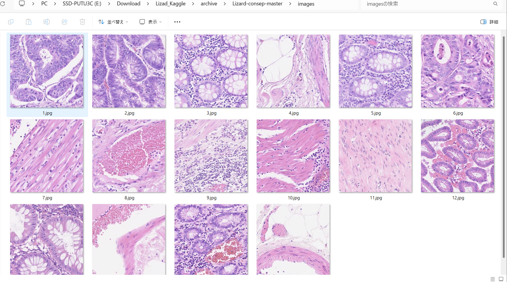 
 
<b>16 consep labels generated from mat files</b> 
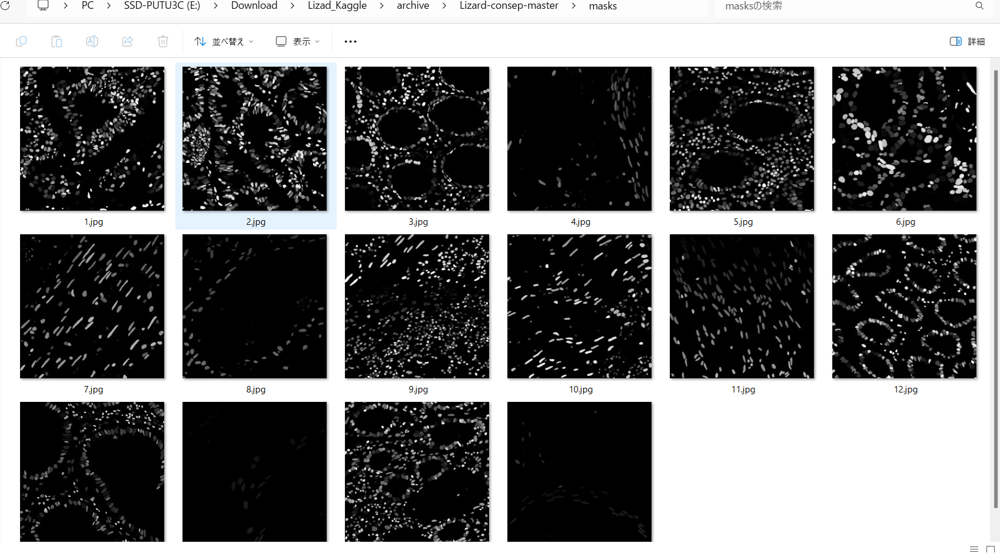 

 
  

<b>Lizard-Consep Statistics</b> 
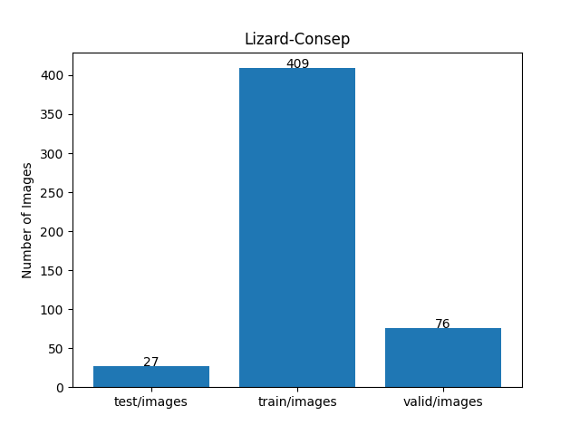 
 
As shown above, the number of images of train and valid datasets is not enough to use for a training set of our segmentation model.
<!-- Therefore, we enabled our online augmentation tool in the training process.
-->
 
 
<b>Train_images_sample</b> 
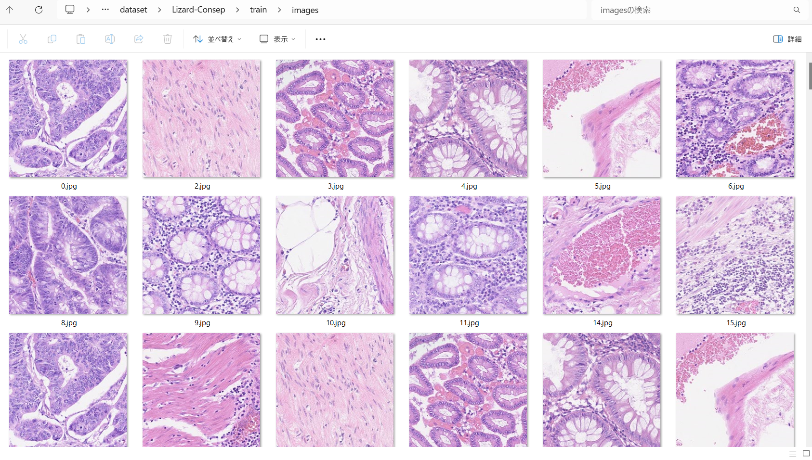
 
<b>Train_masks_sample</b> 
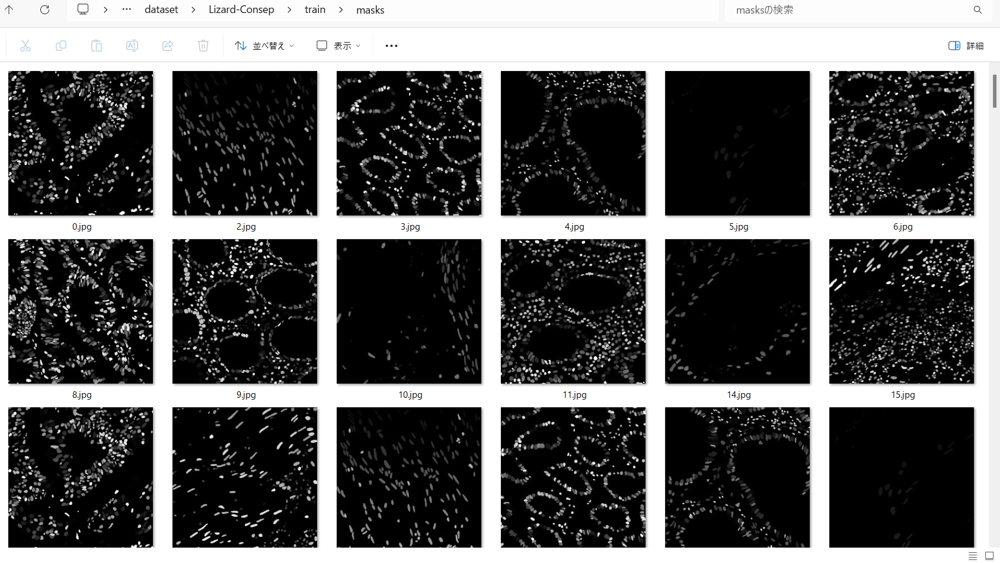
 

<h3>
3 Train TensorflowUNet Model
</h3>
 We have trained Lizard-ConsepTensorflowUNet Model by using the following
<a href="./projects/TensorflowSlightlyFlexibleUNet/Lizard-Consep/train_eval_infer.config"> <b>train_eval_infer.config</b></a> file.  
Please move to ./projects/TensorflowSlightlyFlexibleUNet/Lizard-Consepand run the following bat file. 
<pre>
>1.train.bat
</pre>
, which simply runs the following command. 
<pre>
>python ../../../src/TensorflowUNetTrainer.py ./train_eval_infer.config
</pre>

<b>Model parameters</b> 
Defined a small <b>base_filters</b> and large <b>base_kernels</b> for the first Conv Layer of Encoder Block of 
<a href="./src/TensorflowUNet.py">TensorflowUNet.py</a> 
and a large num_layers (including a bridge between Encoder and Decoder Blocks).
<pre>
[model]
base_filters   = 16
base_kernels   = (9,9)
num_layers     = 8
dilation       = (3,3)
</pre>

<b>Learning rate</b> 
Defined a small learning rate.  
<pre>
[model]
learning_rate  = 0.0001
</pre>

<b>Online augmentation</b> 
Disabled our online augmentation.You may train this model by setting this generator parameter to True. 
<pre>
[model]
model         = "TensorflowUNet"
generator     = False
</pre>

<b>Loss and metrics functions</b> 
Specified "bce_dice_loss" and "dice_coef". 
<pre>
[model]
loss           = "bce_dice_loss"
metrics        = ["dice_coef"]
</pre>
<b>Learning rate reducer callback</b> 
Enabled learing_rate_reducer callback, and a small reducer_patience.
<pre> 
[train]
learning_rate_reducer = True
reducer_factor     = 0.4
reducer_patience   = 4
</pre>

<b>Early stopping callback</b> 
Enabled early stopping callback with patience parameter.
<pre>
[train]
patience      = 10
</pre>

<b>Epoch change inference callbacks</b> 
Enabled epoch_change_infer callback. 
<pre>
[train]
epoch_change_infer       = True
epoch_change_infer_dir   =  "./epoch_change_infer"
epoch_changeinfer        = False
epoch_changeinfer_dir    = "./epoch_changeinfer"
num_infer_images         = 6
</pre>

By using this callback, on every epoch_change, the inference procedure can be called
 for 6 images in <b>mini_test</b> folder. This will help you confirm how the predicted mask changes 
 at each epoch during your training process.    

<b>Epoch_change_inference output</b> 
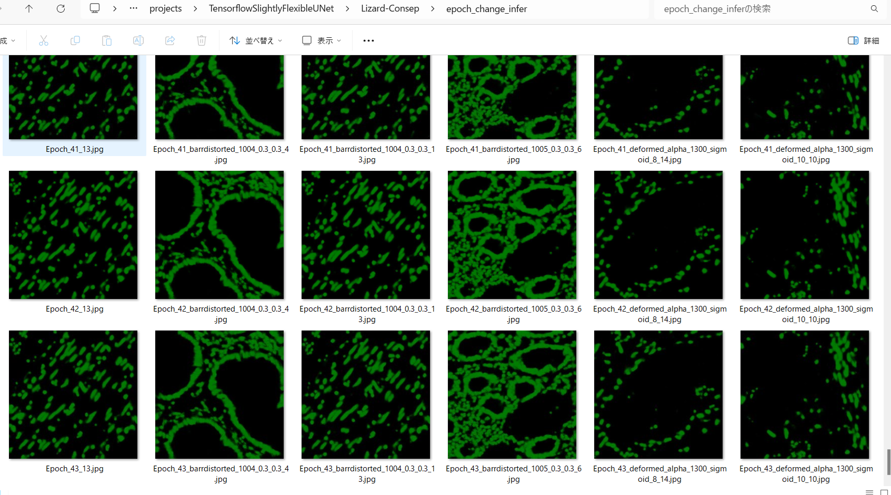 
 

In this experiment, the training process was stopped at epoch 43  by EarlyStopping Callback.  
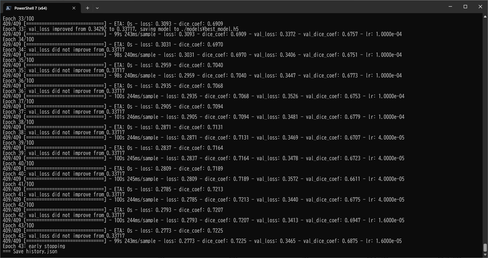 
 

<a href="./projects/TensorflowSlightlyFlexibleUNet/Lizard-Consep/eval/train_metrics.csv">train_metrics.csv</a> 
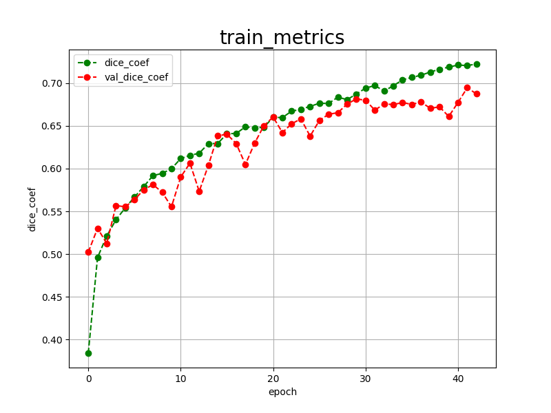 

 
<a href="./projects/TensorflowSlightlyFlexibleUNet/Lizard-Consep/eval/train_losses.csv">train_losses.csv</a> 
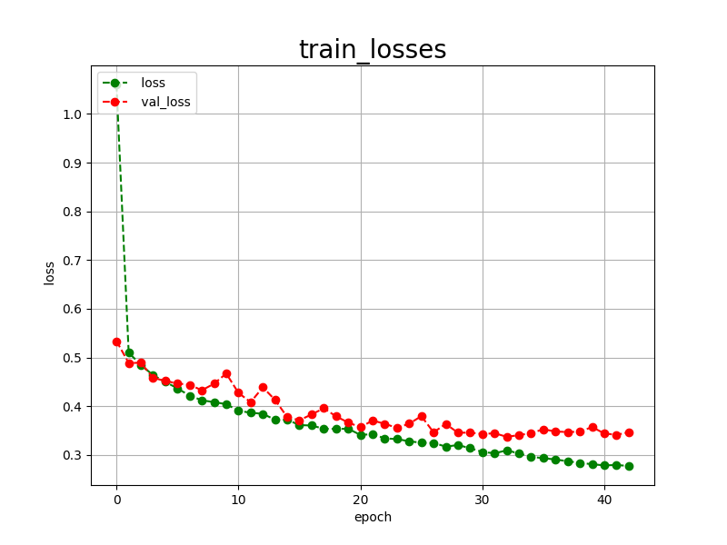 

 

<h3>
4 Evaluation
</h3>
Please move to a <b>./projects/TensorflowSlightlyFlexibleUNet/Lizard-Consep</b> folder, 
and run the following bat file to evaluate TensorflowUNet model for Lizard-Consep. 
<pre>
./2.evaluate.bat
</pre>
This bat file simply runs the following command.
<pre>
python ../../../src/TensorflowUNetEvaluator.py ./train_eval_infer_aug.config
</pre>

Evaluation console output: 
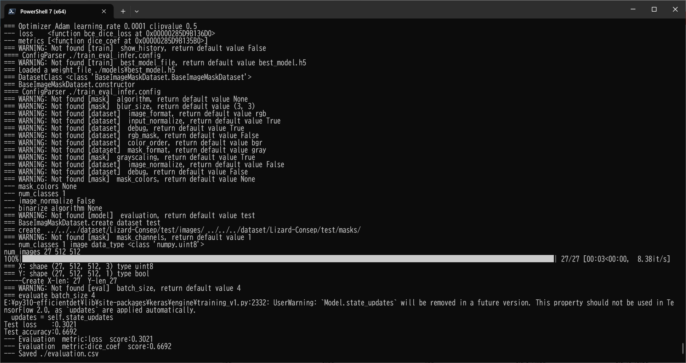
  Image-Segmentation-Lizard-Consep

<a href="./projects/TensorflowSlightlyFlexibleUNet/Lizard-Consep/evaluation.csv">evaluation.csv</a> 

The loss (bce_dice_loss) to this Lizard-Consep/test was not low, but dice_coef not so high as shown below.
 
<pre>
loss,0.3021
dice_coef,0.6692
</pre>
 

<h3>
5 Inference
</h3>
Please move to a <b>./projects/TensorflowSlightlyFlexibleUNet/Lizard-Consep</b> folder 
,and run the following bat file to infer segmentation regions for images by the Trained-TensorflowUNet model for Lizard-Consep. 
<pre>
./3.infer.bat
</pre>
This simply runs the following command.
<pre>
python ../../../src/TensorflowUNetInferencer.py ./train_eval_infer_aug.config
</pre>

<b>mini_test_images</b> 
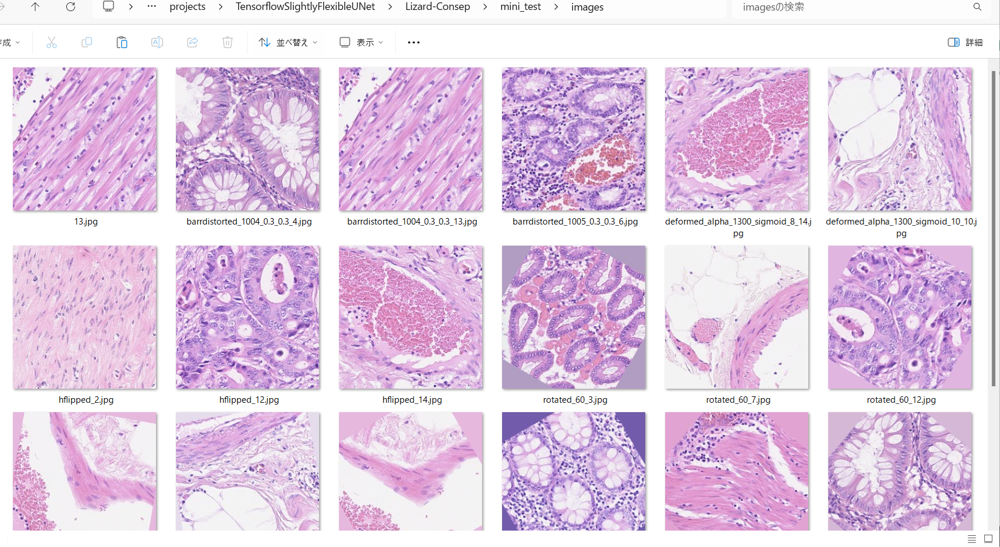 
<b>mini_test_mask(ground_truth)</b> 
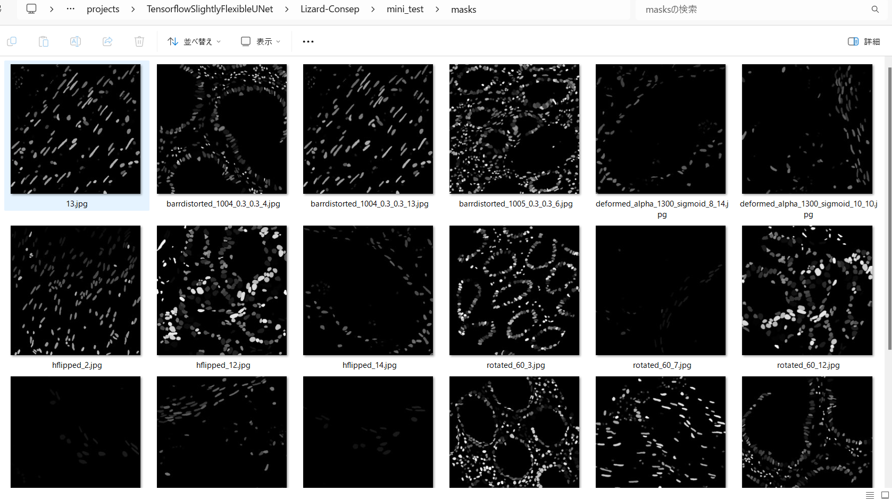 

<b>Inferred test masks</b> 
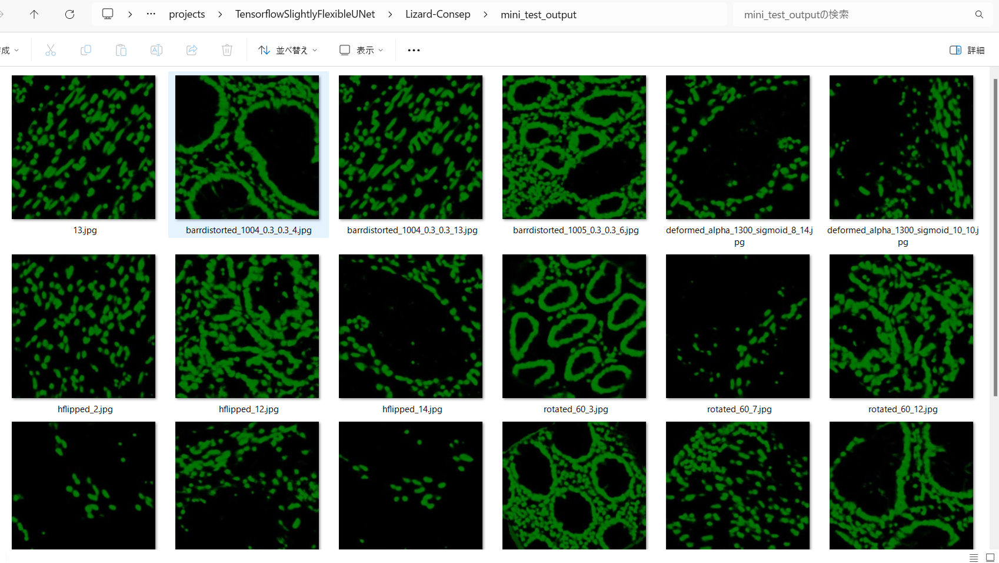 
 

<b>Enlarged images and masks </b> 

<table>
<tr>
<th>Image</th>
<th>Mask (ground_truth)</th>
<th>Inferred-mask</th>
</tr>

<tr>
<td>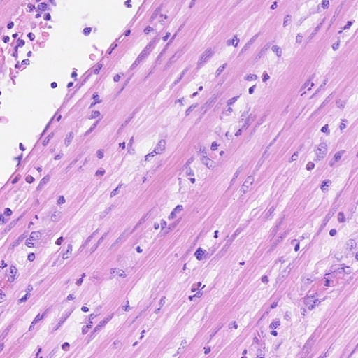</td>
<td>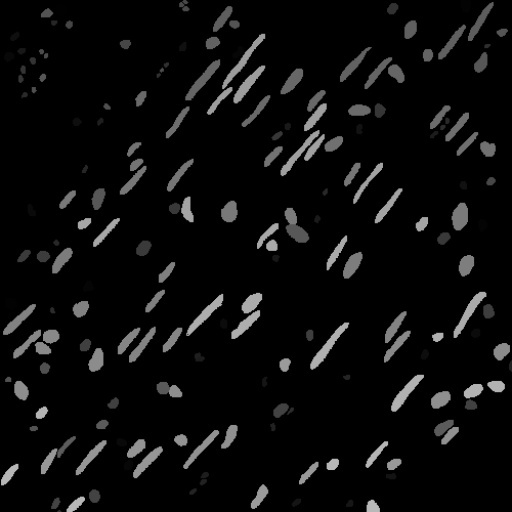</td>
<td>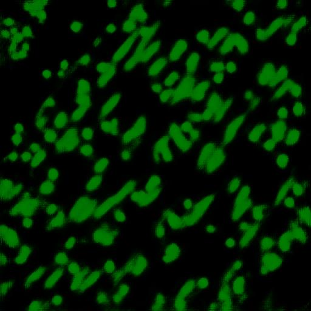</td>
</tr>

<tr>
<td>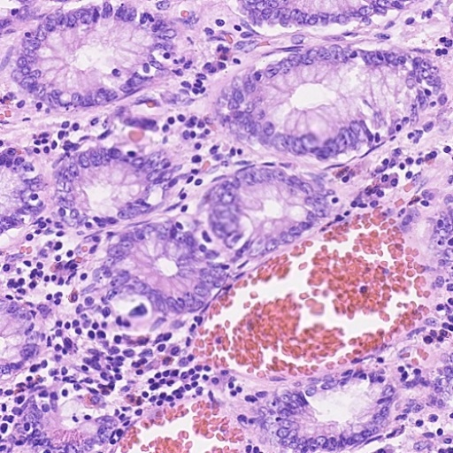</td>
<td>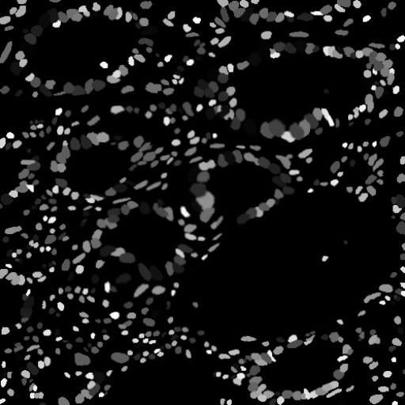</td>
<td>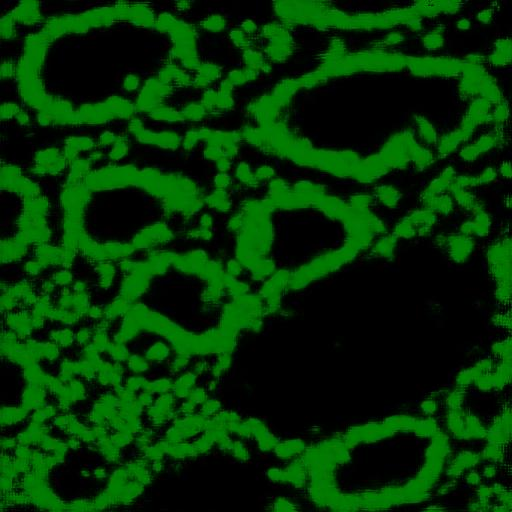</td>
</tr>

<tr>
<td>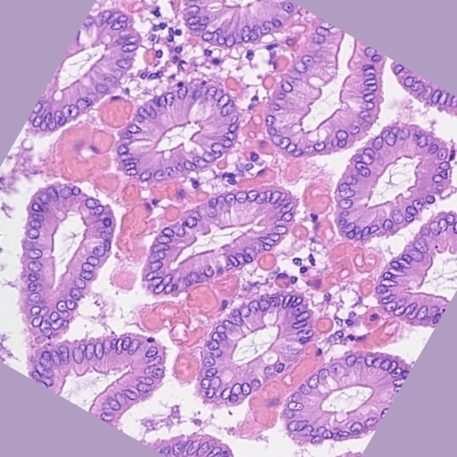</td>
<td>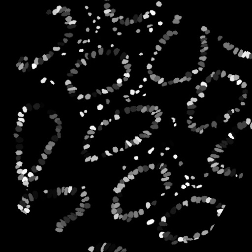</td>
<td>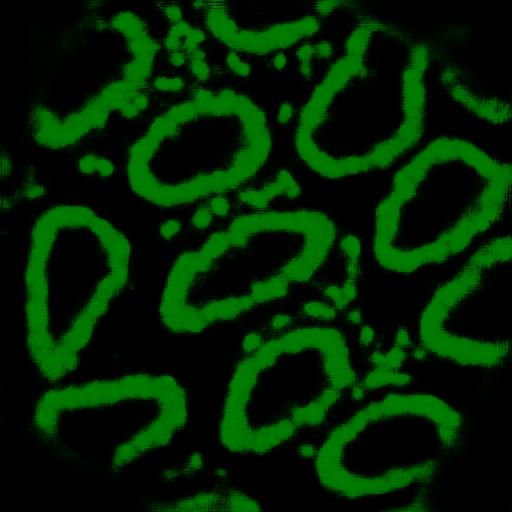</td>
</tr>
<tr>
<td>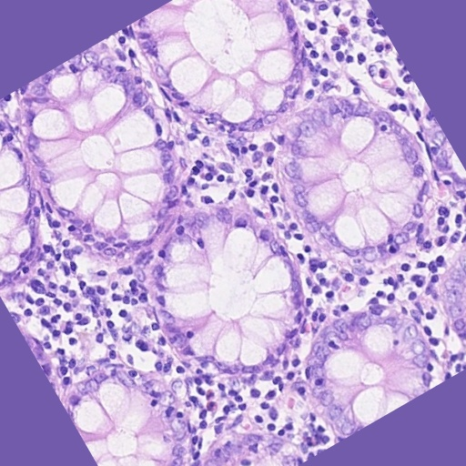</td>
<td>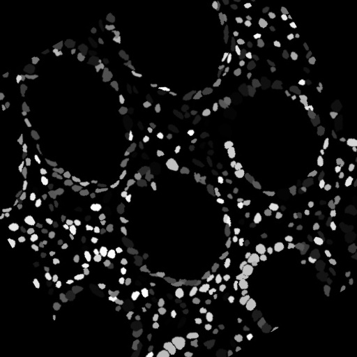</td>
<td>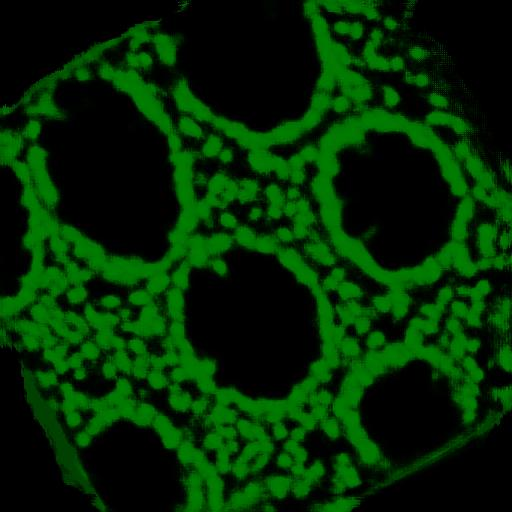</td>
</tr>
<tr>
<td>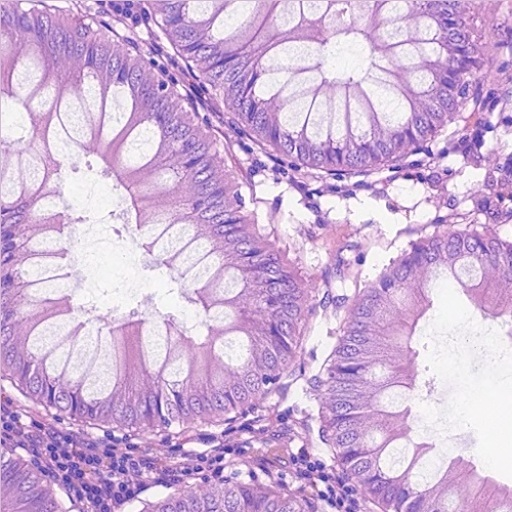</td>
<td>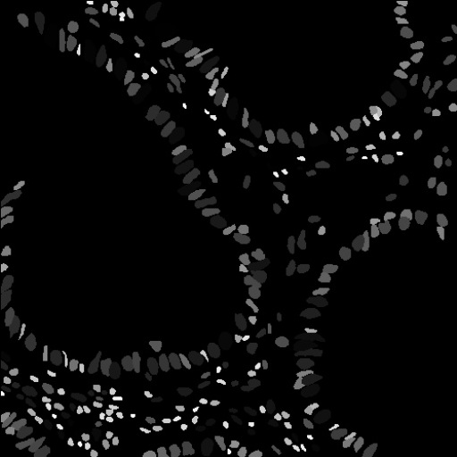</td>
<td>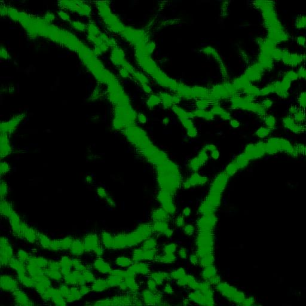</td>
</tr>
<tr>
<td>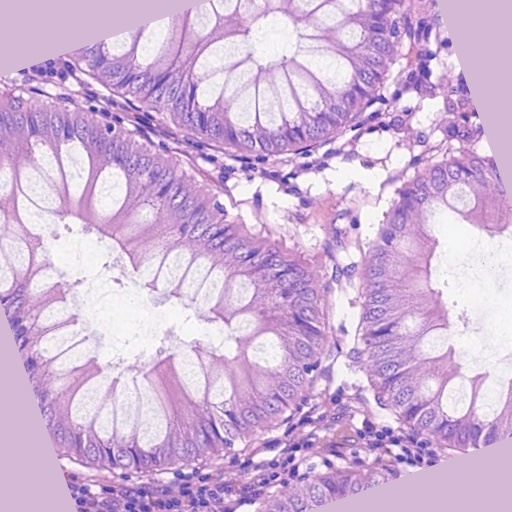</td>
<td>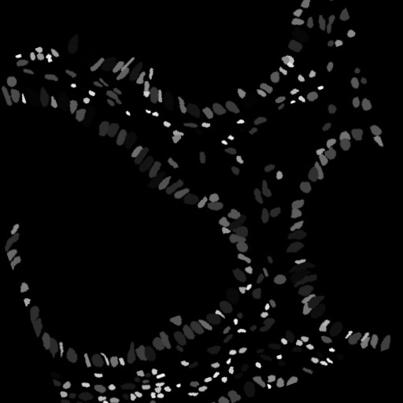</td>
<td>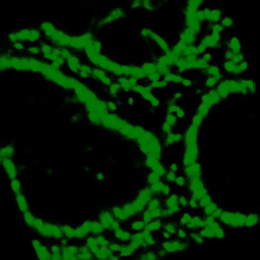</td>
</tr>
</table>

 

<h3>
References
</h3>
<b>1. Lizard: A Large-Scale Dataset for Colonic Nuclear Instance Segmentation and Classification</b> 
<a href=
"https://openaccess.thecvf.com/content/ICCV2021W/CDPath/papers/Graham_Lizard_A_Large-Scale_Dataset_for_Colonic_Nuclear_Instance_Segmentation_and_ICCVW_2021_paper.pdf">
https://openaccess.thecvf.com/content/ICCV2021W/CDPath/papers/Graham_Lizard_A_Large-Scale_Dataset_for_Colonic_Nuclear_Instance_Segmentation_and_ICCVW_2021_paper.pdf
</a>
  
Simon Graham
, Mostafa Jahanifar
, Ayesha Azam
, Mohammed Nimir
, Yee-Wah Tsang
 
,
Katherine Dodd
, Emily Hero,
, Harvir Sahota
, Atisha Tank
, Ksenija Benes
, Noorul Wahab
 
,
Fayyaz Minhas
, Shan E Ahmed Raza
, Hesham El Daly
, Kishore Gopalakrishnan
 
,
David Snead
, Nasir Rajpoot
 

